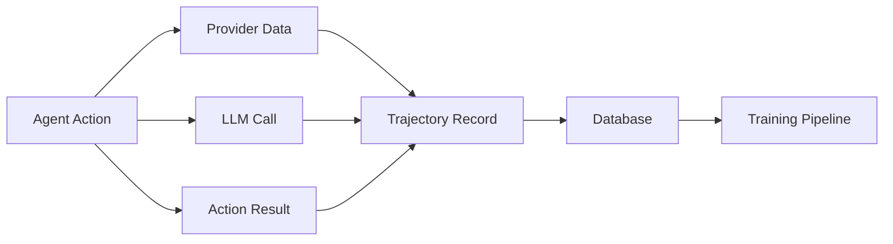

# Trajectory Logging for Agent Training

Complete system for recording agent decisions for reinforcement learning training (ART/GRPO/RULER).

## Overview

The trajectory logging system captures every decision an autonomous agent makes, enabling:
- **Reinforcement Learning**: Train agents on successful strategies
- **Decision Analysis**: Understand why agents make specific choices
- **Performance Optimization**: Identify winning vs losing patterns
- **Model Training**: Generate datasets for ART, GRPO, and RULER training

**Status**: **Production Ready** - 43 automated tests

## Architecture

The system records three critical data points for each agent decision:



### Data Captured

**1. Provider Data (Context)**
- What data the agent accessed
- Why it accessed that data
- When it was accessed

**2. LLM Call (Decision)**
- System prompt used
- User prompt/query
- Model response
- Reasoning/thinking process

**3. Action Result (Outcome)**
- What action was taken
- Parameters used
- Success/failure result
- Reward signal

## Quick Start

### 1. Database Setup

Add trajectory tables to your Prisma schema:

```bash
cat eliza/plugin-trajectory-logger/prisma/schema-trajectory.prisma >> prisma/schema.prisma
npx prisma migrate dev
```

### 2. Wrap Your Actions

```typescript
import {
 wrapActionWithLogging,
 logLLMCallFromAction,
 logProviderFromAction
} from '@elizaos/plugin-trajectory-logger'

const BUY_SHARES = wrapActionWithLogging({
 name: 'BUY_SHARES',
 description: 'Buy prediction market shares',
 
 handler: async (runtime, message, state, options, callback) => {
 // 1. Log data access (provider)
 const markets = await getMarkets()
 logProviderFromAction(state, {
 providerName: 'market_data',
 data: markets,
 purpose: 'Analyze available markets for trading opportunities'
 })
 
 // 2. Log LLM decision
 const decision = await runtime.useModel({
 systemPrompt: 'You are a trading agent...',
 userPrompt: `Analyze these markets: ${JSON.stringify(markets)}`
 })
 
 logLLMCallFromAction(state, {
 model: 'gpt-4',
 systemPrompt,
 userPrompt,
 response: decision,
 thinking: decision.reasoning
 })
 
 // 3. Execute action (result logged automatically)
 const result = await executeTrade(decision.params)
 
 return result
 }
})
```

### 3. Compute Rewards

Define how to score agent decisions:

```typescript
import { defineRewardFunction } from '@elizaos/plugin-trajectory-logger'

export const tradingReward = defineRewardFunction({
 name: 'trading_performance',
 
 compute: (trajectory) => {
 const { result, llmCall } = trajectory
 
 // Reward based on P&L
 if (result.realizedPnL > 0) {
 return result.realizedPnL / 100 // Scale to 0-1
 }
 
 return -0.5 // Penalty for losses
 }
})
```

### 4. Export for Training

```typescript
import { exportToHuggingFace } from '@elizaos/plugin-trajectory-logger'

const dataset = await exportToHuggingFace({
 minReward: 0.5,
 maxTrajectories: 1000,
 format: 'parquet'
})

// Upload to HuggingFace
await dataset.upload('your-org/babylon-trading-trajectories')
```

## Testing

### Run Comprehensive Tests

```bash
cd eliza/plugin-trajectory-logger
npm test
```

**Expected**: 43 tests passing

**Test Coverage**:
- Database schema validation
- Provider logging
- LLM call logging
- Result logging
- Reward computation
- Export functionality
- Data quality checks

### Verify Data Quality

```bash
npx tsx scripts/verify-trajectory-data.ts
```

**Checks**:
- All required fields present
- Data types correct
- Timestamps valid
- Rewards computed
- Export format correct

## Data Requirements

### Required for Each Decision

**Provider Data**:
```typescript
{
 providerName: string // e.g., "market_data"
 data: any // The actual data accessed
 purpose: string // Why this data was needed
 timestamp: number
}
```

**LLM Call**:
```typescript
{
 model: string // e.g., "gpt-4"
 systemPrompt: string // Agent's system instructions
 userPrompt: string // The query/request
 response: string // Model's response
 thinking?: string // Reasoning process
 timestamp: number
}
```

**Action Result**:
```typescript
{
 action: string // Action name
 params: any // Action parameters
 result: any // Execution result
 success: boolean // Did it work?
 timestamp: number
}
```

## Training Pipeline Integration

### Export to HuggingFace

```typescript
// Export successful trajectories
const dataset = await exportToHuggingFace({
 minReward: 0.7, // Only successful trades
 timeRange: '7d', // Last 7 days
 format: 'parquet', // Efficient format
 includeMetadata: true
})

// Dataset structure:
{
 prompt: string, // System + user prompts
 response: string, // LLM response
 reward: number, // Computed reward
 context: object, // Provider data
 metadata: object // Timestamps, agent ID, etc.
}
```

### Training with ART

```python
from art import ARTTrainer

trainer = ARTTrainer(
 dataset="your-org/babylon-trading-trajectories",
 base_model="Qwen/Qwen2.5-0.5B-Instruct",
 iterations=1000
)

# Train on successful decisions
model = trainer.train(min_reward=0.7)
```

## Best Practices

### 1. Log Everything

```typescript
// Good: Log all data access
logProviderFromAction(state, {
 providerName: 'balance_check',
 data: balance,
 purpose: 'Verify sufficient funds before trading'
})

// Bad: Skip logging
const balance = await getBalance()
```

### 2. Capture Reasoning

```typescript
// Good: Include thinking process
logLLMCallFromAction(state, {
 model,
 systemPrompt,
 userPrompt,
 response: decision,
 thinking: decision.reasoning // Important!
})

// Bad: Skip reasoning
logLLMCallFromAction(state, { model, systemPrompt, userPrompt, response })
```

### 3. Compute Meaningful Rewards

```typescript
// Good: Reward based on actual performance
const reward = (pnl > 0) ? pnl / initialInvestment : -0.5

// Bad: Binary rewards
const reward = success ? 1 : 0
```

## Integration with Babylon

### Example: Trading Agent

```typescript
import { wrapActionWithLogging } from '@elizaos/plugin-trajectory-logger'

const BABYLON_TRADE = wrapActionWithLogging({
 name: 'BABYLON_TRADE',
 
 handler: async (runtime, message, state, options) => {
 // Log market data access
 const markets = await runtime.a2aClient.getMarkets()
 logProviderFromAction(state, {
 providerName: 'babylon_markets',
 data: markets,
 purpose: 'Analyze prediction markets for trading'
 })
 
 // Log trading decision
 const decision = await runtime.useModel({
 systemPrompt: runtime.character.system,
 userPrompt: `Analyze these markets and decide: ${JSON.stringify(markets)}`
 })
 
 logLLMCallFromAction(state, {
 model: 'gpt-4',
 systemPrompt: runtime.character.system,
 userPrompt,
 response: decision,
 thinking: decision.reasoning
 })
 
 // Execute trade
 const result = await runtime.a2aClient.buyShares({
 marketId: decision.marketId,
 outcome: decision.outcome,
 amount: decision.amount
 })
 
 // Result logged automatically
 // Reward computed based on eventual P&L
 return result
 }
})
```

## Advanced Features

### Reward Functions

Define custom reward functions:

```typescript
export const multiFactorReward = defineRewardFunction({
 name: 'multi_factor_trading',
 
 compute: (trajectory) => {
 const { result, llmCall } = trajectory
 
 let reward = 0
 
 // P&L component (50%)
 if (result.pnl > 0) {
 reward += 0.5 * (result.pnl / result.investment)
 }
 
 // Speed component (25%)
 if (result.executionTime < 1000) {
 reward += 0.25
 }
 
 // Confidence component (25%)
 if (llmCall.thinking?.includes('high confidence')) {
 reward += 0.25
 }
 
 return Math.min(1, Math.max(-1, reward))
 }
})
```

### Data Quality Checks

```typescript
import { validateTrajectory } from '@elizaos/plugin-trajectory-logger'

const isValid = validateTrajectory(trajectory)

if (!isValid.valid) {
 console.error('Invalid trajectory:', isValid.errors)
 // - Missing required fields
 // - Invalid data types
 // - Timestamp issues
 // - Malformed JSON
}
```

## Resources

- **Plugin Source**: `eliza/plugin-trajectory-logger/`
- **Complete Guide**: `eliza/plugin-trajectory-logger/README.md`
- **Example Action**: `eliza/plugin-trajectory-logger/EXAMPLE_ACTION.md`
- **Data Requirements**: `eliza/plugin-trajectory-logger/DATA_REQUIREMENTS.md`
- **Testing Checklist**: `eliza/plugin-trajectory-logger/TESTING_CHECKLIST.md`

## Next Steps

- [Autonomous Agent Guide](/agents/autonomous-guide)
- [Python RL Training](/agents/python-training)
- [ElizaOS Plugin](/agents/eliza-plugin)
- [Agent Performance Optimization](/agents/optimization)

