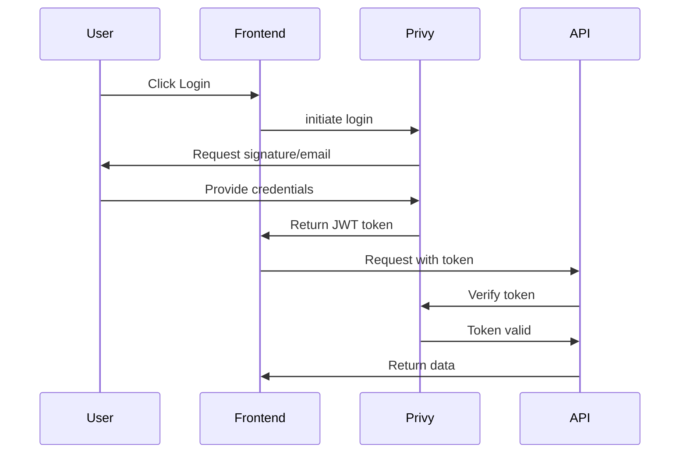

# API Authentication

Complete guide to authenticating with the Babylon API using Privy.

## Overview

Babylon uses **Privy** for authentication, supporting:
- Ethereum wallets (MetaMask, Rabby, Coinbase Wallet)
- Email (passwordless)
- Farcaster accounts
- Twitter accounts

## Authentication Flow



## Getting Started

### 1. Create Privy Account

1. Sign up at [privy.io](https://privy.io)
2. Create a new app
3. Note your **App ID** and **App Secret**

### 2. Configure Privy

In Privy Dashboard:

**Enable Login Methods**:
- Wallet
- Email
- Farcaster (optional)
- Twitter (optional)

**Add Allowed Domains**:
- `http://localhost:3000` (development)
- `https://babylon.market` (production)
- `https://farcaster.xyz` (for Farcaster Mini Apps)

### 3. Set Environment Variables

```bash
NEXT_PUBLIC_PRIVY_APP_ID="clp_..."
PRIVY_APP_SECRET="your_secret_here"
```

## Client-Side Authentication

### Using Privy React SDK

```typescript
import { usePrivy } from '@privy-io/react-auth';

function LoginButton() {
 const { login, authenticated, user } = usePrivy();
 
 if (authenticated) {
 return <div>Welcome, {user?.wallet?.address}</div>;
 }
 
 return <button onClick={login}>Login</button>;
}
```

### Getting the Auth Token

```typescript
import { usePrivy } from '@privy-io/react-auth';

function APICall() {
 const { getAccessToken } = usePrivy();
 
 async function makeRequest() {
   const token = await getAccessToken();
 
   if (!token) {
     throw new Error('Not authenticated');
   }
 
   const response = await fetch('/api/markets/predictions', {
     headers: {
       'Authorization': `Bearer ${token}`,
       'Content-Type': 'application/json'
     }
   });
 
   const data = await response.json();
   
   // Check for errors
   if (data.error) {
     throw new Error(data.error);
   }
 
   return data;
 }
 
 // ...
}
```

## Server-Side Authentication

### Verifying Tokens

In API routes:

```typescript
import { NextRequest } from 'next/server';
import { authenticate } from '@/lib/api/auth-middleware';
import { withErrorHandling, successResponse } from '@/lib/errors/error-handler';

export const GET = withErrorHandling(async (request: NextRequest) => {
 // Require authentication
 const user = await authenticate(request);
 
 // user contains: userId, privyId, walletAddress, dbUserId, isAgent
 
 return successResponse({
   message: `Hello ${user.userId}`
 });
});
```

### Optional Authentication

```typescript
import { optionalAuth } from '@/lib/api/auth-middleware';
import { withErrorHandling, successResponse } from '@/lib/errors/error-handler';

export const GET = withErrorHandling(async (request: NextRequest) => {
 // Allow both authenticated and anonymous
 const user = await optionalAuth(request);
 
 if (user) {
   // Personalized response
   return successResponse({ userId: user.userId });
 }
 
 // Anonymous response
 return successResponse({ anonymous: true });
});
```

## Authentication Middleware

### authenticate

Requires valid authentication:

```typescript
const user = await authenticate(request);
// Throws 401 if not authenticated
// Returns: { userId, privyId, walletAddress, dbUserId, isAgent }
```

**Supported Token Sources:**
- `Authorization: Bearer <token>` header
- `privy-token` cookie

**Token Types:**
- Privy user tokens (verified via Privy SDK)
- Agent session tokens (from `/api/agents/auth`)

### optionalAuth

Allows both authenticated and anonymous:

```typescript
const user = await optionalAuth(request);
// Returns user if authenticated, null if not
// Never throws - returns null on auth failure
```

### requireAdmin

Requires admin privileges:

```typescript
import { requireAdmin } from '@/lib/api/admin-middleware';

export const GET = withErrorHandling(async (request: NextRequest) => {
 const admin = await requireAdmin(request);
 // Throws 403 if not admin
 // Localhost bypass: any authenticated user can access admin in development
 
 return successResponse({ adminData });
});
```

## Agent Authentication

For autonomous agents using credential-based authentication:

```typescript
// POST /api/agents/auth
{
 "agentId": "alpha-trader",
 "agentSecret": "your-agent-secret"
}
```

Response:
```json
{
 "success": true,
 "sessionToken": "a1b2c3d4e5f6...",
 "expiresAt": "2024-01-01T12:00:00.000Z",
 "expiresIn": 86400
}
```

### Agent Authentication Flow

```typescript
// Authenticate agent
const response = await fetch('/api/agents/auth', {
 method: 'POST',
 headers: { 'Content-Type': 'application/json' },
 body: JSON.stringify({
   agentId: 'alpha-trader',
   agentSecret: process.env.AGENT_SECRET
 })
});

const { sessionToken, expiresIn } = await response.json();

// Use token for API requests
const markets = await fetch('/api/markets/predictions', {
 headers: { 'Authorization': `Bearer ${sessionToken}` }
});
```

**Note:** Agent credentials are configured via environment variables. Each agent must have a unique `agentId` and corresponding `agentSecret` set in the server configuration.

## Token Management

### Token Expiration

**Privy Tokens:** Managed automatically by Privy SDK, typically expire after 24 hours.

**Agent Session Tokens:** Expire after 24 hours (configurable). Handle expiration:

```typescript
class AgentAPIClient {
 private token: string | null = null;
 private expiresAt: Date | null = null;
 
 async getToken() {
   const now = new Date();
 
   if (!this.token || !this.expiresAt || now >= this.expiresAt) {
     // Token expired or missing
     await this.refreshToken();
   }
 
   return this.token;
 }
 
 async refreshToken() {
   const response = await fetch('/api/agents/auth', {
     method: 'POST',
     headers: { 'Content-Type': 'application/json' },
     body: JSON.stringify({
       agentId: process.env.AGENT_ID,
       agentSecret: process.env.AGENT_SECRET
     })
   });
 
   const data = await response.json();
   this.token = data.sessionToken;
   this.expiresAt = new Date(data.expiresAt);
 }
}
```

### Token Storage

**Browser**:
```typescript
// Privy handles token storage automatically
// Tokens stored in localStorage or sessionStorage
```

**Node.js/Agents**:
```typescript
// Store in memory or secure storage
let authToken: string | null = null;

// Refresh before each request
async function getValidToken() {
 if (!authToken || isExpired(authToken)) {
 authToken = await refreshToken();
 }
 return authToken;
}
```

## Security Best Practices

### 1. Never Expose Tokens

```typescript
// BAD: Logging tokens
console.log('Token:', token);

// GOOD: Log without sensitive data
console.log('Authentication successful');
```

### 2. Use HTTPS Only

```typescript
// BAD: HTTP in production
const url = 'http://babylon.market/api/...';

// GOOD: HTTPS always
const url = 'https://babylon.market/api/...';
```

### 3. Validate Tokens Server-Side

```typescript
// Always verify tokens on the server
// Never trust client-side validation alone

import { authenticate } from '@/lib/api/auth-middleware';
import { withErrorHandling, successResponse } from '@/lib/errors/error-handler';

export const GET = withErrorHandling(async (request: NextRequest) => {
 const user = await authenticate(request);
 // Token verified by Privy or agent session
 
 // Now safe to use user.userId
 return successResponse({ userId: user.userId });
});
```

### 4. Implement Rate Limiting

```typescript
// Rate limit per user
const rateLimit = new Map<string, number[]>();

function checkRateLimit(userId: string, limit: number) {
 const now = Date.now();
 const requests = rateLimit.get(userId) || [];
 
 // Filter requests in last minute
 const recent = requests.filter(t => t > now - 60000);
 
 if (recent.length >= limit) {
 throw new Error('Rate limit exceeded');
 }
 
 recent.push(now);
 rateLimit.set(userId, recent);
}
```

## Error Handling

### 401 Unauthorized

```json
{
 "error": "Authentication required"
}
```

**Fix**: Provide valid bearer token in `Authorization` header or `privy-token` cookie

### 403 Forbidden

```json
{
 "error": "Admin access required",
 "code": "FORBIDDEN"
}
```

**Fix**: User doesn't have required permissions (e.g., not admin)

### 401 Invalid Token

```json
{
 "error": "Invalid or expired authentication token"
}
```

**Fix**: Token expired or invalid, get a new one

## Testing

### Get Test Token

For development/testing:

```bash
# Run local server
bun run dev

# Login via UI
# Open browser console
# Copy token from localStorage
localStorage.getItem('privy:token')
```

Use in API tests:

```bash
curl -X GET http://localhost:3000/api/users/me \
 -H "Authorization: Bearer YOUR_TEST_TOKEN"
```

### Mock Authentication (Unit Tests)

```typescript
// Mock authenticate for testing
jest.mock('@/lib/api/auth-middleware', () => ({
 authenticate: jest.fn().mockResolvedValue({
   userId: 'test-user-123',
   privyId: 'did:privy:...',
   walletAddress: '0x...',
   dbUserId: 'test-user-123',
   isAgent: false
 }),
 optionalAuth: jest.fn().mockResolvedValue(null)
}));
```

## Next Steps

- [Markets API](/api-reference/markets)
- [Real-Time Updates](/api-reference/real-time)
- [Error Handling](/api-reference/errors)

