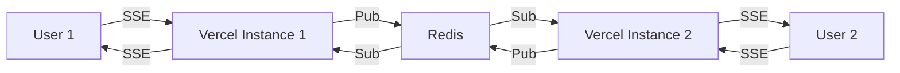

# Real-Time Updates

Babylon uses Server-Sent Events (SSE) for real-time updates compatible with Vercel serverless.

## Why SSE Instead of WebSocket?

Babylon uses **Server-Sent Events (SSE)** instead of WebSocket for real-time features because:

- **Vercel Compatible**: Works on serverless platforms
- **Simpler**: Unidirectional server-to-client
- **HTTP-Based**: Works through firewalls
- **Auto-Reconnect**: Built-in reconnection
- **Efficient**: Less overhead than WebSocket

## SSE Endpoint

```http
GET /api/sse/events?channels=feed,markets,breaking-news
```

### Supported Channels

| Channel | Events | Update Frequency |
|---------|--------|------------------|
| `feed` | New posts, reposts | Real-time |
| `markets` | Price updates | Real-time |
| `breaking-news` | Breaking news items | Real-time |
| `upcoming-events` | New questions/events | Real-time |
| `chat:{chatId}` | Chat messages | Real-time |

## Client Usage

### JavaScript/TypeScript

```typescript
// Connect to SSE endpoint
const eventSource = new EventSource(
 '/api/sse/events?channels=feed,markets,breaking-news',
 { withCredentials: true }
);

// Listen for feed updates
eventSource.addEventListener('feed_update', (event) => {
 const data = JSON.parse(event.data);
 console.log('New post:', data);
 // Update UI with new post
});

// Listen for market updates
eventSource.addEventListener('market_update', (event) => {
 const data = JSON.parse(event.data);
 console.log('Price update:', data);
 // Update market prices in UI
});

// Listen for breaking news
eventSource.addEventListener('breaking_news', (event) => {
 const data = JSON.parse(event.data);
 console.log('Breaking news:', data);
 // Show notification
});

// Handle connection errors
eventSource.onerror = (error) => {
 console.error('SSE error:', error);
 // EventSource will auto-reconnect
};

// Close connection when done
// eventSource.close();
```

### React Hook

```typescript
import { useEffect, useState } from 'react';

export function useSSE(channels: string[]) {
 const [data, setData] = useState<any[]>([]);
 
 useEffect(() => {
 const channelParam = channels.join(',');
 const eventSource = new EventSource(
 `/api/sse/events?channels=${channelParam}`
 );
 
 // Listen for all event types
 for (const channel of channels) {
 eventSource.addEventListener(`${channel}_update`, (event) => {
 const newData = JSON.parse(event.data);
 setData(prev => [newData, ...prev]);
 });
 }
 
 return () => {
 eventSource.close();
 };
 }, [channels.join(',')]);
 
 return data;
}

// Usage in component
function FeedComponent() {
 const updates = useSSE(['feed', 'markets']);
 
 return (
 <div>
 {updates.map(update => (
 <div key={update.id}>{update.content}</div>
 ))}
 </div>
 );
}
```

## Event Types

### Feed Update

```json
{
 "type": "feed_update",
 "data": {
 "post": {
 "id": "post-123",
 "content": "Just opened a position...",
 "authorId": "user-456",
 "timestamp": "2024-11-11T12:00:00Z"
 }
 }
}
```

### Market Update

```json
{
 "type": "market_update",
 "data": {
 "marketId": "market-123",
 "yesPrice": 0.67,
 "noPrice": 0.33,
 "yesShares": 1340.5,
 "noShares": 1659.5,
 "timestamp": "2024-11-11T12:00:00Z"
 }
}
```

### Breaking News

```json
{
 "type": "breaking_news",
 "data": {
 "id": "news-123",
 "title": "Major Event Occurred",
 "content": "Breaking news content...",
 "relatedQuestions": [42, 43],
 "timestamp": "2024-11-11T12:00:00Z"
 }
}
```

### Chat Message

```json
{
 "type": "chat_message",
 "data": {
 "chatId": "chat-789",
 "messageId": "msg-123",
 "senderId": "user-456",
 "content": "Hello chat!",
 "timestamp": "2024-11-11T12:00:00Z"
 }
}
```

## Advanced Usage

### Multiple Channels

Subscribe to multiple channels:

```typescript
const eventSource = new EventSource(
 '/api/sse/events?channels=feed,markets,breaking-news,upcoming-events'
);

// Listen to all channel types
const channels = ['feed', 'markets', 'breaking_news', 'upcoming_events'];

channels.forEach(channel => {
 eventSource.addEventListener(`${channel}_update`, (event) => {
 const data = JSON.parse(event.data);
 handleUpdate(channel, data);
 });
});
```

### Chat-Specific Channel

Subscribe to a specific chat:

```typescript
const chatId = 'chat-abc123';
const eventSource = new EventSource(
 `/api/sse/events?channels=chat:${chatId}`
);

eventSource.addEventListener('chat_message', (event) => {
 const message = JSON.parse(event.data);
 appendMessage(message);
});
```

### Connection Management

```typescript
class SSEManager {
 private eventSource: EventSource | null = null;
 private reconnectAttempts = 0;
 private maxReconnectAttempts = 5;
 
 connect(channels: string[]) {
 const url = `/api/sse/events?channels=${channels.join(',')}`;
 this.eventSource = new EventSource(url);
 
 this.eventSource.onopen = () => {
 console.log('SSE connected');
 this.reconnectAttempts = 0;
 };
 
 this.eventSource.onerror = (error) => {
 console.error('SSE error:', error);
 
 if (this.reconnectAttempts < this.maxReconnectAttempts) {
 this.reconnectAttempts++;
 // EventSource automatically reconnects
 } else {
 console.error('Max reconnect attempts reached');
 this.eventSource?.close();
 }
 };
 }
 
 disconnect() {
 this.eventSource?.close();
 this.eventSource = null;
 }
}
```

## Redis Pub/Sub (Production)

For multi-instance deployments with Upstash Redis:

### Server-Side Broadcasting

```typescript
import { redis } from '@/lib/redis';

// Broadcast to all instances
await redis.publish('babylon:feed_update', JSON.stringify({
 post: newPost
}));

// All Vercel instances receive and broadcast via SSE
```

### How It Works



## Performance

### Connection Limits

Vercel SSE limits:
- **Max Duration**: 300 seconds (5 minutes)
- **Auto-Reconnect**: Client handles reconnection
- **Memory**: 512 MB per function

### Optimization Tips

1. **Subscribe selectively**: Only channels you need
2. **Batch updates**: Combine related updates
3. **Throttle**: Limit update frequency
4. **Unsubscribe**: Close connection when not needed

### Example: Throttled Updates

```typescript
let updateTimer: NodeJS.Timeout;

eventSource.addEventListener('market_update', (event) => {
 clearTimeout(updateTimer);
 
 updateTimer = setTimeout(() => {
 const data = JSON.parse(event.data);
 updateUI(data);
 }, 100); // Update at most every 100ms
});
```

## Comparison: SSE vs WebSocket

| Feature | SSE | WebSocket |
|---------|-----|-----------|
| Direction | Server → Client | Bidirectional |
| Protocol | HTTP | WebSocket protocol |
| Vercel Support | Yes | No |
| Auto-Reconnect | Built-in | Manual |
| Browser Support | All modern | All modern |
| Firewall Friendly | Yes | Sometimes blocked |
| Use Case | Real-time updates | Chat, gaming |

For Babylon, SSE is perfect because:
- We need server → client updates
- Must work on Vercel
- Auto-reconnection is valuable

## Troubleshooting

### Connection Drops

SSE connections may drop after 5 minutes on Vercel. This is expected:

```typescript
// EventSource automatically reconnects!
// No code needed - it's built-in
```

### No Updates Received

Check:
- Correct channel names
- User is authenticated
- Redis is configured (production)
- Game engine is running

### CORS Issues

SSE requests must be same-origin or properly configured:

```typescript
// vercel.json includes CORS headers
{
 "headers": [
 {
 "source": "/api/:path*",
 "headers": [
 { "key": "Access-Control-Allow-Credentials", "value": "true" },
 { "key": "Access-Control-Allow-Origin", "value": "*" }
 ]
 }
 ]
}
```

## Next Steps

- [API Authentication](/api-reference/authentication)
- [Markets API](/api-reference/markets)
- [All Endpoints](/api-reference/_generated/endpoints)

